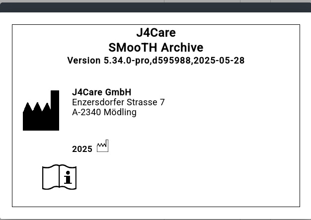

ISO Preamble
************

.. _copyright:

Copyright Information
=====================

©2009-2025 J4Care GmbH. Enzersdorfer Strasse 7, 2340 Mödling, Austria. All rights reserved. The material contained in this document is proprietary to J4Care GmbH. No rights in said material are hereby transferred by J4Care GmbH. This material may not be disclosed, duplicated or otherwise revealed, in whole or in part, without prior written consent.

.. _trademarks:

Trademarks
==========

J4Care Smooth Archive and the corporate logo are trademarks or registered trademarks of J4Care GmbH in Austria throughout the world. All other company and product names are used for identification purposes only and may be trademarks of their respective owners. J4Care GmbH cannot guarantee completion of any future products or product features mentioned in this document, and no reliance should be placed on their availability.

Further information about J4care products: http://www.j4care.com/

.. _disclaimer:

Disclaimer of Warranty
======================

©J4care GmbH ©2009-2025

This J4Care document is proporietary to J4Care GmbH and no ownership rights are hereby transferred.

J4Care GmbH does not make any representations, warranties or guarantees, express or implied, as to the accuracy or completeness of the Manual. Users must be aware that updates and amendments will be made from time to time to the Manual. It is the user's responsibility to determine whether there have been any such updates or amendments. Neither J4Care GmbH nor any of its directors, officers, employees or agents shall be liable in contract, tort or in any other manner whatsoever to any person for any loss, damage, injury, liability, cost or expense of any nature, including without limitation incidental, special, direct or consequential damages arising out of or in connection with the use of the Manual. J4care GmbH, Enzersdorfer Strasse 7, 2340 Mödling, Austria

.. _responsibility:

Manufacturer’s Responsibility
=============================

The manufacturer, installer, or importer will be responsible for the safety, reliability, and performance of the equipment only if:

    Installation, modifications, adjustments, changes, or repairs are performed by suitably qualified service personnel.
    The electrical installation of the site in which the equipment is used is according to an applicable safety standard (UL, CSA, or IEC/CDE).
    The equipment is used according to the instructions provided in the operation manuals.

.. _labeling:

Product Labeling
================

.. _revisions:

Revision Record for Document AEN-00039-0516.10
==============================================

.. list-table:: Release Notes
   :header-rows: 1

   * - ID
     - Release Notes
     - Date
     - Author
     - Reviewer
   * - 87
     - `Release Notes 5.33.1 <https://docs.j4care.com/archive/releases/pro-release-5-33-1>`_
     - **11.10.2024**
     - P. Kalina
     - J.Friedrichkeit
   * - 86
     - `Release Notes 5.33.0 <https://docs.j4care.com/archive/releases/pro-release-5-33-0>`_
     - **20.9.2024**
     - P. Kalina
     - J.Friedrichkeit
   * - 85
     - `Release Notes 5.32.1 <https://docs.j4care.com/archive/releases/pro-release-5-32-1>`_
     - **26.7.2024**
     - P. Kalina
     - J.Friedrichkeit
   * - 84
     - `Release Notes 5.32.0 <https://docs.j4care.com/archive/releases/pro-release-5-32-0>`_
     - **30.4.2024**
     - P. Kalina
     - J.Friedrichkeit
   * - 83
     - `Release Notes 5.31.3 <https://docs.j4care.com/archive/releases/pro-release-5-31-3>`_
     - **29.1.2024**
     - P. Kalina
     - J.Friedrichkeit
   * - 82
     - `Release Notes 5.31.2 <https://docs.j4care.com/archive/releases/pro-release-5-31-2>`_
     - **4.1.2024**
     - P. Kalina
     - J.Friedrichkeit
   * - 81
     - `Release Notes 5.31.1 <https://docs.j4care.com/archive/releases/pro-release-5-31-1>`_
     - **11.10.2023**
     - P. Kalina
     - J.Friedrichkeit
   * - 80
     - `Release Notes 5.31.0 <https://docs.j4care.com/archive/releases/pro-release-5-31-0>`_
     - **31.8.2023**
     - P. Kalina
     - J.Friedrichkeit
   * - 79
     - `Release Notes 5.30.0 <https://docs.j4care.com/archive/releases/pro-release-5-30-0>`_
     - **5.5.2023**
     - P. Kalina
     - J.Friedrichkeit
   * - 78
     - `Release Notes 5.29.2 <https://docs.j4care.com/archive/releases/pro-release-5-29-2>`_
     - **5.4.2023**
     - P. Kalina
     - J.Friedrichkeit
   * - 77
     - `Release Notes 5.29.1 <https://docs.j4care.com/archive/releases/pro-release-5-29-1>`_
     - **29.11.2022**
     - P. Kalina
     - J.Friedrichkeit
   * - 76
     - `Release Notes 5.28.0 <https://docs.j4care.com/archive/releases/pro-release-5-28-0>`_
     - **31.08.2022**
     - P. Kalina
     - J.Friedrichkeit
   * - 75
     - `Release Notes 5.27.0 <https://docs.j4care.com/archive/releases/pro-release-5-27-0>`_
     - **03.08.2022**
     - P. Kalina
     - J.Friedrichkeit
   * - 74
     - `Release Notes 5.26.1 <https://docs.j4care.com/archive/releases/pro-release-5-26-1>`_
     - **05.07.2022**
     - P. Kalina
     - J.Friedrichkeit
   * - 73
     - `Release Notes 5.26.0 <https://docs.j4care.com/archive/releases/pro-release-5-26-0>`_
     - **25.04.2022**
     - G.Zeilinger
     - J.Friedrichkeit
   * - 72
     - `Release Notes 5.25.2 <https://docs.j4care.com/archive/releases/pro-release-5-25-2>`_
     - **14.02.2022**
     - G.Zeilinger
     - J.Friedrichkeit
   * - 71
     - `Release Notes 5.25.1 <https://docs.j4care.com/archive/releases/pro-release-5-25-1>`_
     - **29.12.2021**
     - G.Zeilinger
     - J.Friedrichkeit
   * - 70
     - `Release Notes 5.25.0 <https://docs.j4care.com/archive/releases/pro-release-5-25-0>`_
     - **14.12.2021**
     - G.Zeilinger
     - J.Friedrichkeit
   * - 69
     - `Release Notes 5.24.2 <https://docs.j4care.com/archive/releases/pro-release-5-24-2>`_
     - **14.10.2021**
     - G.Zeilinger
     - J.Friedrichkeit
   * - 68
     - `Release Notes 5.24.1 <https://docs.j4care.com/archive/releases/pro-release-5-24-1>`_
     - **15.09.2021**
     - G.Zeilinger
     - J.Friedrichkeit
   * - 67
     - `Release Notes 5.24.0 <https://docs.j4care.com/archive/releases/pro-release-5-24-0>`_
     - **06.08.2021**
     - G.Zeilinger
     - J.Friedrichkeit
   * - 66
     - `Release Notes 5.23.3 <https://docs.j4care.com/archive/releases/pro-release-5-23-3>`_
     - **18.05.2021**
     - G.Zeilinger
     - J.Friedrichkeit
   * - 65
     - `Release Notes 5.23.2 <https://docs.j4care.com/archive/releases/pro-release-5-23-2>`_
     - **24.03.2021**
     - G.Zeilinger
     - J.Friedrichkeit
   * - 64
     - `Release Notes 5.23.1 <https://docs.j4care.com/archive/releases/pro-release-5-23-1>`_
     - **10.02.2021**
     - G.Zeilinger
     - J.Friedrichkeit
   * - 63
     - `Release Notes 5.23.0 <https://docs.j4care.com/archive/releases/pro-release-5-23-0>`_
     - **14.12.2020**
     - G.Zeilinger
     - J.Friedrichkeit
   * - 62
     - `Release Notes 5.22.6 <https://docs.j4care.com/archive/releases/pro-release-5-22-6>`_
     - **16.10.2020**
     - G.Zeilinger
     - J.Friedrichkeit
   * - 61
     - `Release Notes 5.22.5 GA <https://docs.j4care.com/archive/releases/pro-release-5-22-5-ga>`_
     - **01.10.2020**
     - G.Zeilinger
     - J.Friedrichkeit
   * - 60
     - `Release Notes 5.22.4 GA <https://docs.j4care.com/archive/releases/pro-release-5-22-4-ga>`_
     - **20.08.2020**
     - G.Zeilinger
     - J.Friedrichkeit
   * - 59
     - `Release Notes 5.22.3 GA <https://docs.j4care.com/archive/releases/pro-release-5-22-3-ga>`_
     - **30.06.2020**
     - G.Zeilinger
     - J.Friedrichkeit
   * - 58
     - `Release Notes 5.22.2 GA <https://docs.j4care.com/archive/releases/pro-release-5-22-2-ga>`_
     - **29.05.2020**
     - G.Zeilinger
     - J.Friedrichkeit
   * - 57
     - `Release Notes 5.22.1 GA <https://docs.j4care.com/archive/releases/pro-release-5-22-1-ga>`_
     - **10.04.2020**
     - G.Zeilinger
     - J.Friedrichkeit
   * - 56
     - `Release Notes 5.22.0 GA <https://docs.j4care.com/archive/releases/pro-release-5-22-0-ga>`_
     - **13.03.2020**
     - G.Zeilinger
     - J.Friedrichkeit
   * - 55
     - `Release Notes 5.21.0 GA <https://docs.j4care.com/archive/releases/pro-release-5-21-0-ga>`_
     - **28.01.2020**
     - G.Zeilinger
     - J.Friedrichkeit
   * - 54
     - `Release Notes 5.20.0 GA <https://docs.j4care.com/archive/releases/pro-release-5-20-0-ga>`_
     - **20.12.2019**
     - G.Zeilinger
     - J.Friedrichkeit
   * - 53
     - `Release Notes 5.19.1 GA <https://docs.j4care.com/archive/releases/pro-release-5-19-1-ga>`_
     - **19.11.2019**
     - G.Zeilinger
     - J.Friedrichkeit
   * - 52
     - `Release Notes 5.19.0 GA <https://docs.j4care.com/archive/releases/pro-release-5-19-0-ga>`_
     - **10.10.2019**
     - G.Zeilinger
     - J.Friedrichkeit
   * - 51
     - `Release Notes 5.18.1 GA <https://docs.j4care.com/archive/releases/pro-release-5-18-1-ga>`_
     - **05.09.2019**
     - G.Zeilinger
     - J.Friedrichkeit
   * - 50
     - `Release Notes 5.18.0 GA <https://docs.j4care.com/archive/releases/pro-release-5-18-0-ga>`_
     - **02.08.2019**
     - G.Zeilinger
     - J.Friedrichkeit
   * - 49
     - `Release Notes 5.17.1 GA <https://docs.j4care.com/archive/releases/pro-release-5-17-1-ga>`_
     - **12.07.2019**
     - G.Zeilinger
     - J.Friedrichkeit
   * - 48
     - `Release Notes 5.17.0 GA <https://docs.j4care.com/archive/releases/pro-release-5-17-0-ga>`_
     - **04.06.2019**
     - G.Zeilinger
     - J.Friedrichkeit
   * - 47
     - `Release Notes 5.16.2 GA <https://docs.j4care.com/archive/releases/pro-release-5-16-2-ga>`_
     - **25.04.2019**
     - G.Zeilinger
     - J.Friedrichkeit
   * - 46
     - `Release Notes 5.16.1 GA <https://docs.j4care.com/archive/releases/pro-release-5-16-1-ga>`_
     - **09.04.2019**
     - G.Zeilinger
     - J.Friedrichkeit
   * - 45
     - `Release Notes 5.16.0 GA <https://docs.j4care.com/archive/releases/pro-release-5-16-0-ga>`_
     - **01.03.2019**
     - G.Zeilinger
     - J.Friedrichkeit
   * - 44
     - Release Notes 5.15.1 GA
     - **10.01.2019**
     - G.Zeilinger
     - J.Friedrichkeit
   * - 43
     - link not available
     - **21.11.2018**
     - G.Zeilinger
     - J.Friedrichkeit
   * - 42
     - link not available
     - **03.10.2018**
     - G.Zeilinger
     - J.Friedrichkeit
   * - 41
     - link not available
     - **29.08.2018**
     - G.Zeilinger
     - J.Friedrichkeit
   * - 40
     - link not available
     - **12.07.2018**
     - G.Zeilinger
     - J.Friedrichkeit
   * - 39
     - link not available
     - **06.06.2018**
     - G.Zeilinger
     - J.Friedrichkeit
   * - 38
     - link not available
     - **15.05.2018**
     - G.Zeilinger
     - J.Friedrichkeit
   * - 37
     - link not available
     - **31.03.2018**
     - G.Zeilinger
     - J.Friedrichkeit
   * - 36
     - link not available
     - **13.02.2018**
     - G.Zeilinger
     - J.Friedrichkeit
   * - 35
     - link not available
     - **27.11.2018**
     - G.Zeilinger
     - J.Friedrichkeit
   * - 34
     - link not available
     - **09.10.2017**
     - G.Zeilinger
     - J.Friedrichkeit
   * - 33
     - link not available
     - **25.08.2017**
     - G.Zeilinger
     - J.Friedrichkeit
   * - 32
     - link not available
     - **10.07.2017**
     - G.Zeilinger
     - J.Friedrichkeit
   * - 31
     - link not available
     - **12.06.2017**
     - G.Zeilinger
     - J.Friedrichkeit
   * - 30
     - link not available
     - **18.05.2017**
     - G.Zeilinger
     - J.Friedrichkeit
   * - 29
     - link not available
     - **27.04.2017**
     - G.Zeilinger
     - J.Friedrichkeit
   * - 28
     - link not available
     - **30.03.2017**
     - G.Zeilinger
     - J.Friedrichkeit
   * - 27
     - link not available
     - **10.03.2017**
     - G.Zeilinger
     - J.Friedrichkeit
   * - 26
     - link not available
     - **21.02.2017**
     - G.Zeilinger
     - J.Friedrichkeit
   * - 25
     - link not available
     - **15.02.2017**
     - G.Zeilinger
     - J.Friedrichkeit
   * - 24
     - link not available
     - **01.02.2017**
     - G.Zeilinger
     - J.Friedrichkeit
   * - 23
     - link not available
     - **29.12.2016**
     - G.Zeilinger
     - J.Friedrichkeit
   * - 22
     - link not available
     - **23.12.2016**
     - G.Zeilinger
     - J.Friedrichkeit
   * - 21
     - link not available
     - **14.11.2016**
     - G.Zeilinger
     - J.Friedrichkeit
   * - 20
     - link not available
     - **02.11.2016**
     - G.Zeilinger
     - J.Friedrichkeit
   * - 19
     - link not available
     - **25.10.2016**
     - G.Zeilinger
     - J.Friedrichkeit
   * - 18
     - link not available
     - **14.10.2016**
     - G.Zeilinger
     - J.Friedrichkeit
   * - 17
     - link not available
     - **12.10.2016**
     - G.Zeilinger
     - J.Friedrichkeit
   * - 16
     - link not available
     - **07.10.2016**
     - G.Zeilinger
     - J.Friedrichkeit
   * - 15
     - link not available
     - **15.09.2016**
     - G.Zeilinger
     - J.Friedrichkeit
   * - 14
     - link not available
     - **31.08.2016**
     - G.Zeilinger
     - J.Friedrichkeit
   * - 13
     - link not available
     - **02.08.2016**
     - G.Zeilinger
     - J.Friedrichkeit
   * - 12
     - link not available
     - **18.07.2016**
     - G.Zeilinger
     - J.Friedrichkeit
   * - 11
     - link not available
     - **11.07.2016**
     - G.Zeilinger
     - J.Friedrichkeit
   * - 10
     - link not available
     - **29.06.2016**
     - G.Zeilinger
     - J.Friedrichkeit
   * - 09
     - link not available
     - **20.06.2016**
     - G.Zeilinger
     - J.Friedrichkeit
   * - 08
     - link not available
     - **14.06.2016**
     - G.Zeilinger
     - J.Friedrichkeit
   * - 07
     - link not available
     - **01.06.2016**
     - G.Zeilinger
     - J.Friedrichkeit
   * - 06
     - link not available
     - **27.05.2016**
     - G.Zeilinger
     - J.Friedrichkeit
   * - 05
     - link not available
     - **25.05.2016**
     - G.Zeilinger
     - J.Friedrichkeit
   * - 04
     - link not available
     - **17.05.2016**
     - G.Zeilinger
     - J.Friedrichkeit
   * - 03
     - link not available
     - **17.05.2016**
     - G.Zeilinger
     - J.Friedrichkeit
   * - 02
     - link not available
     - **25.05.2016**
     - G.Zeilinger
     - J.Friedrichkeit
   * - 01
     - link not available
     - **02.11.2015**
     - G.Zeilinger
     - J.Friedrichkeit
